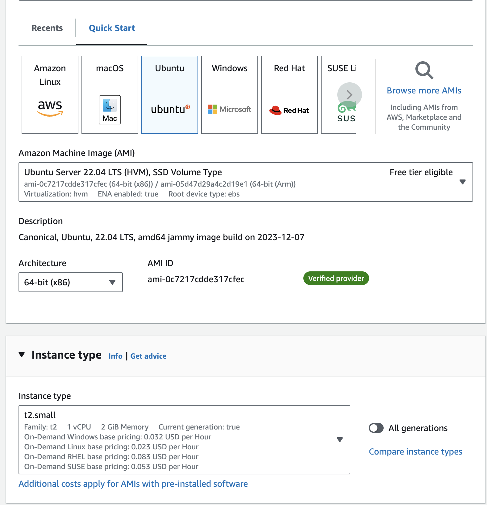
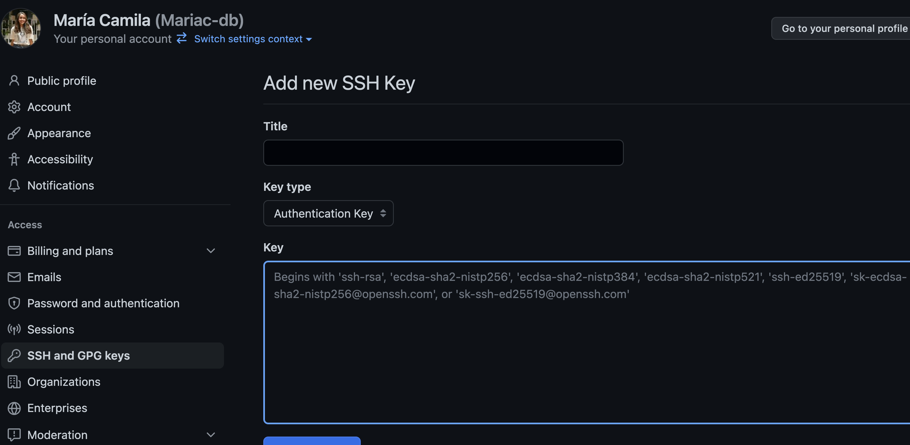

## Pasos para ejecutar el deploy en instancia de AWS (ec2) implementando ambientes con postman.

1. Crea una instancia en AWS

Con Sys de Ubuntu y tamaño small. No olvides generar tus keys(Key par)

2. Dar permisos al servidor para acceder al repositorio de desarrollo

* generar llaves 

`ssh_keygen`
`cat .ssh/id_rsa.pub` (copiar contenido de llaves)

Ir al repositorio y añadir las llaves, sobre decir que NO debes compartirlas con nadie. 

3. Dar permisos al servidor editando segurity groups.

* Añadir PORT para db 5433 (config en docker-compose.yml)

* Añadir PORT para API 5004 (en este port vamos a recibir las solicitudes de nuestra apo)

Para ambas configuración de Custom TCP indicamos conexión desde cualquier dirección IP (IPv4). Recuerda que una dirección IP (También conocido como local host). IP identifica a un dispositivo en una red, esta IP puede ser local, pública o privada. El PORT o puerto, es un número que indica que se usa para dirigir datos a un servicio o dispositivos dada una dirección determinada. No tienes que ser experto en backend para desplegar modelos de Machine Learning, es cuestión de comprender cosas básicas para que puedas hacer la integración de las partes de un sistema. 

4. Al interior del repo realiza un swith a la rama productiva donde haremos el deploy y ejecuta los comandos que se encuentran en `script-install-docker.sh`

¡Estamos listos para el deploy!

Ejecuta en consola el build y el up del docker: 

`docker-compose build`
`docker-compose up`

¡Sigue los pasos de la clase de deploy!

#insertar imagen
