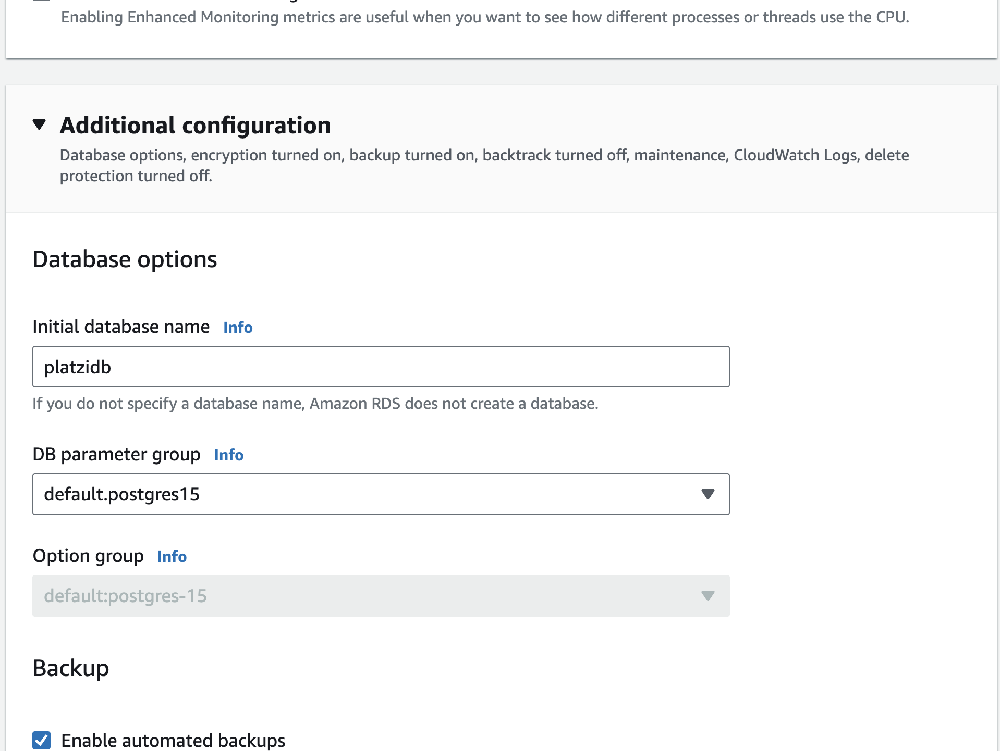
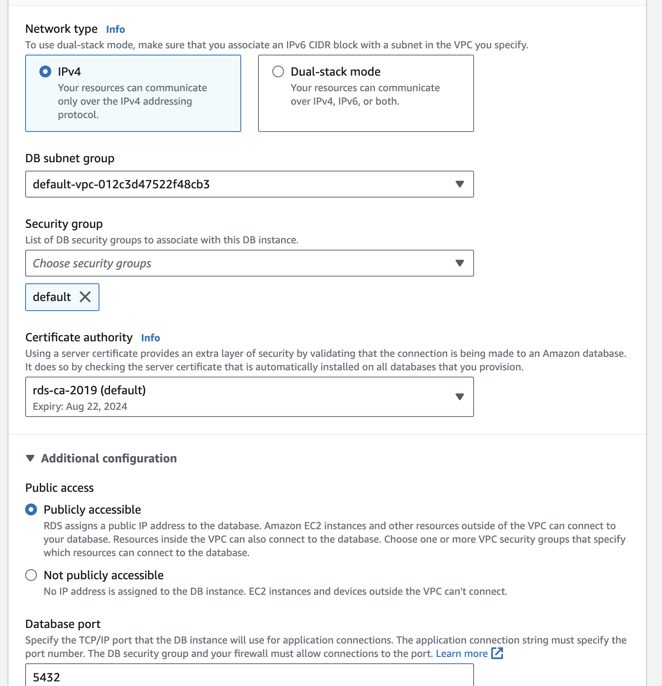

# Basic AWS setup

Acá te enseñaré a configurar la instancia, db y bucket para configurar mlflow.

1. Lo primero, debes de [tener una cuenta en aws](https://aws.amazon.com/free).

2. Abre un instancia en EC2. 

Seleccionamos una instancia de  (`Amazon Linux 2 AMI (HVM) - Kernel 5.10, SSD Volume Type`) con tipo `t2.micro`, las cuales son gratuitos.

Adicionalmente, debemos crear una nueva key la cual nos va a permitir ingresar a la instancia a través de llaves SSH. Haz click en "Create new key pair", selecciona RSA en Key pair type y .pem en el formato para la llave privada. 

Posteriormente, tenemos que editar los grupos de seguridad para que nuestra instancia EC2 pueda aceptar la conexión SSH (mediante port 22) y para mlflow nos podamos conectar a traves del port 5000 (Type Custom TCP):

3. Creamos bucket para almacenar nuestros metadatos y artifacts.

Vamos a s3 damos click en "create bucket". 

Note: El nombre del bucket debe ser único. 

4. Creamos un PostgreSQL database para ser usado como backend store. 

Ingresamos al servicio de RDS damos click en "Create database". Elige la versión.

Asigna nombre a la  DB instance (puede ser mlflow), asigna un username y por último,  asigna una contraseña, la puedes generar automáticamente también si lo deseas. 

Finalmente, dada la configuración especificada, se creará una db inicial para ti. 

Para la connectivity vamos a indicar que sea pública, desde cualquier dirección e indicamos db port. 

Una vez creada la db, copia la contraseña porque la verás una única vez y la necesitaremos más adelante (en el caso que la hayas creado automáticamente). 

A modo de resumen toma nota de lo siguiente porque lo vas a necesitar :

* master username
* password 
* initial database name
* endpoint

Una vez más, debemos ir a configurar el grupo de seguridad para que nuestra base de datos pueda comunicarse, por lo que hacemos la conexión de type PostSQL y habilitamos el port 5432. De esta manera, el servidor se podrá conectar a la base de postgresql como backend.db. Tal y como lo hemos aprendido en nuestra forma de tracking 2. En grupos de seguridad debes de tener en cuenta que debe de ser el mismo grupo de nuestra instancia EC2 que hemos credo previamente. 

5. Conexión a la EC2 instancia y acceder al server tracking de mlflow. 

Vamos a darle vida y setear dependencias y todo lo que necesitamos:

* `sudo yum update -y` actualizamos paquetes de la instancia
* `sudo yum install -y python3-pip`
*  `pip3 --version`
* `pip3 install mlflow boto3 psycopg2-binary`
* `aws configure`   # añades tus tokens de acceso de aws
* `mlflow server -h 0.0.0.0 -p 5000 --backend-store-uri postgresql://DB_USER:DB_PASSWORD@DB_ENDPOINT:5432/DB_NAME --default-artifact-root s3://S3_BUCKET_NAME` hacemos esta configuración! 

Note: Para verificar que todo funciona super bien, verifica con `aws s3 ls`

6. Acceso al servidor de forma local.

Abre tu navegador e ingresa: `http://<EC2_PUBLIC_DNS_DE_TU_EC2>:5000` (Esto lo puedes ver en la configuración de tu instancia). 

7. Vamos al código y ejecuta tu software de ML con mlflow! 